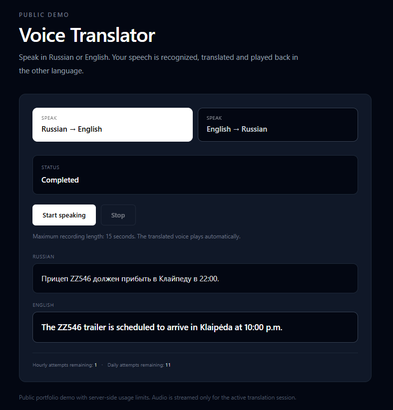
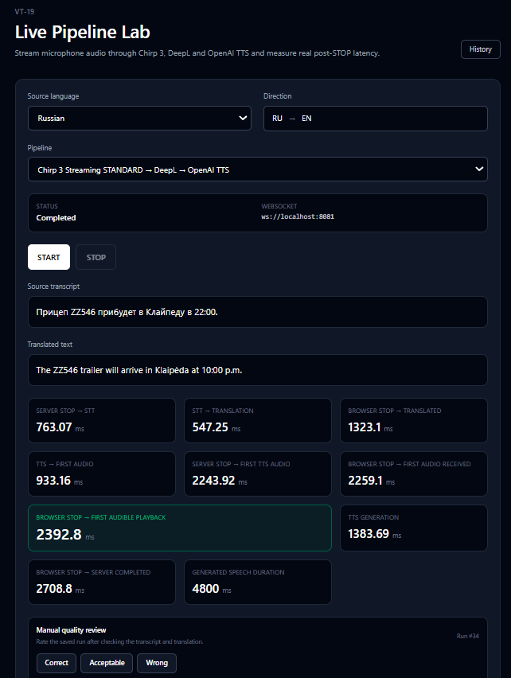
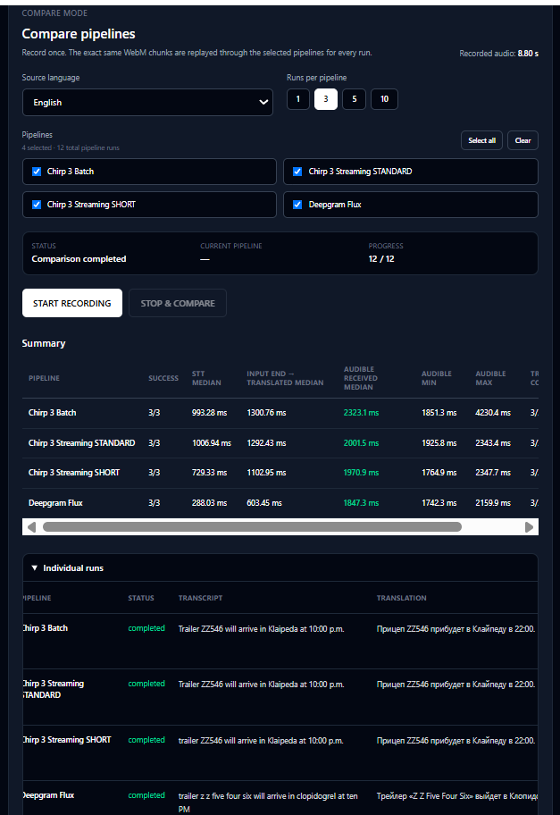
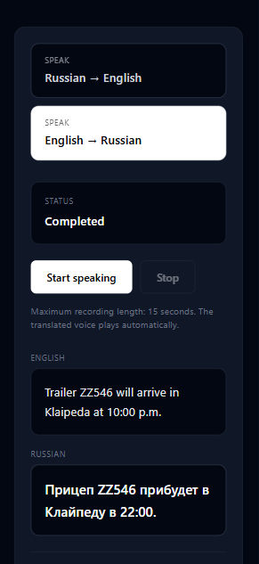

# Voice Translator

Voice Translator is a push-to-talk RU ↔ EN voice translation application built with Laravel.

The project explores how speech recognition, machine translation, and speech synthesis can be combined into a responsive browser-based translation pipeline while keeping external providers replaceable and measurable.

**Live demo:** https://voice.kotov.lt

<p align="center">
  
</p>

## Why this project exists

The original idea was simple: allow two people who speak different languages to communicate using voice.

A user speaks in Russian or English, finishes the phrase, and the application:

1. recognizes the speech;
2. translates the recognized text;
3. synthesizes the translation;
4. plays the translated speech in the browser.

The project later evolved beyond the basic translation flow into an engineering laboratory for comparing speech-recognition approaches, measuring latency, reviewing recognition quality, and testing complete end-to-end voice pipelines.

The current portfolio release intentionally uses a push-to-talk interaction model rather than simultaneous interpretation.

## Supported languages

The current production demo supports:

- Russian → English
- English → Russian

Additional languages are intentionally outside the scope of the v1.0.0 portfolio release.

## Production flow

```text
Browser microphone
        ↓
    WebSocket
        ↓
Laravel WebSocket server
        ↓
Google Chirp 3 Streaming STT
        ↓
DeepL Translation
        ↓
OpenAI Text-to-Speech
        ↓
Browser audio playback
```

The recognized source text and translated text are also displayed to the user.

## Production profiles

The public demo uses language-specific pipeline profiles selected from benchmark results.

### Russian → English

```text
Google Chirp 3 Streaming STANDARD
        ↓
DeepL
        ↓
OpenAI TTS
```

Profile:

```text
chirp3-streaming-standard-deepl-openai
```

### English → Russian

```text
Google Chirp 3 Streaming SHORT
        ↓
DeepL
        ↓
OpenAI TTS
```

Profile:

```text
chirp3-streaming-short-deepl-openai
```

The profile is selected server-side from the source language. Public clients cannot choose arbitrary benchmark or provider profiles.

## Engineering approach

The project was developed using a measurement-driven workflow:

```text
Hypothesis
    ↓
Benchmark
    ↓
Measurements
    ↓
Decision
    ↓
Architecture
    ↓
Implementation
```

Instead of choosing a speech provider only from documentation or marketing claims, multiple approaches were tested with reproducible recordings and measured under the same conditions.

## Benchmarking

The repository contains benchmark tooling for:

- batch speech recognition;
- streaming speech recognition;
- translation providers;
- realtime translation;
- complete STT → Translation → TTS pipelines.

Speech fixtures are designed to include cases such as:

- short commands;
- longer sentences;
- numbers;
- times;
- distances;
- names and place names;
- logistics terminology;
- pauses;
- similar-sounding words.

Provider output is stored without manual correction before evaluation.

Text normalization is used so recognition quality is not dominated by punctuation or capitalization differences.

### Why the same recording is reused

A microphone recording provides a fairer pipeline comparison when every profile receives the same audio input.

Compare runs therefore reuse the same recorded audio across profiles.

This reduces differences caused by:

- pronunciation changes between attempts;
- speaking speed;
- microphone timing;
- pauses;
- different wording;
- recording inconsistency.

The resulting comparison focuses on pipeline behaviour rather than differences between repeated recordings.

## Representative speech results

The following measurements come from the project's recorded benchmark fixture set.

They are useful for comparing the tested profiles inside this project and should not be interpreted as universal provider benchmarks.

| Pipeline | RU quality | RU STOP → STT | EN quality | EN STOP → STT |
| --- | ---: | ---: | ---: | ---: |
| Chirp 3 Batch | 93.33% | ~981 ms | 90.63% | ~876 ms |
| Chirp 3 Streaming STANDARD | 93.33% | ~718 ms | 90.63% | ~813 ms |
| Chirp 3 Streaming SHORT | 90.00% | ~247 ms | 90.63% | ~676 ms |
| Deepgram Flux | 86.67% | ~258 ms | 78.13% | ~291 ms |

The results showed that the lowest recognition latency was not automatically the best production choice.

For Russian, Chirp 3 Streaming STANDARD preserved the stronger recognition result while reducing finalization latency compared with the batch pipeline.

For English, Chirp 3 Streaming SHORT retained the measured recognition quality of STANDARD while providing better finalization latency.

This led to the current language-specific public demo profiles.

## Live Pipeline Lab

The internal Live Pipeline Lab was created after the initial provider benchmarks.

It allows complete voice translation pipelines to be tested from the browser instead of evaluating each provider in isolation.

The Lab supports profiles including:

- Chirp 3 Batch + DeepL + OpenAI TTS;
- Chirp 3 Streaming STANDARD + DeepL + OpenAI TTS;
- Chirp 3 Streaming SHORT + DeepL + OpenAI TTS;
- Deepgram Flux + DeepL + OpenAI TTS.

The Lab records metrics such as:

- input audio duration;
- STOP → final STT;
- translation duration;
- TTS → first audio;
- STOP → audio ready;
- STOP → browser playback.

It also provides:

- persisted pipeline runs;
- Compare mode;
- replay of identical microphone audio;
- History;
- manual quality review;
- diagnostics.

<p align="center">
  
  
</p>

The Live Pipeline Lab is internal engineering tooling and is disabled in the public production environment.

## Provider-neutral architecture

External providers are isolated behind application contracts instead of being called directly from controllers.

Important contracts include:

```text
SpeechToTextProvider
StreamingSpeechToTextProvider
TranslationProvider
RealtimeTranslationProvider
TextToSpeechProvider
StreamingTextToSpeechProvider
StreamingWebSocketConnection
StreamingWebSocketFactory
```

This allows benchmark and pipeline implementations to replace providers without rewriting the core orchestration flow.

The project contains integrations and experiments involving the following providers.

### Speech recognition

- Google Speech-to-Text;
- Google Chirp 3;
- Google Chirp 3 Streaming;
- Deepgram Nova-3;
- Deepgram Flux.

### Translation

- DeepL;
- Google Cloud Translation;
- OpenAI text translation;
- OpenAI realtime translation experiments.

### Text-to-Speech

- OpenAI Text-to-Speech.

The production public pipeline currently uses:

```text
Google Chirp 3 Streaming
        +
DeepL
        +
OpenAI TTS
```

## Public demo

The simplified public demo is available at:

https://voice.kotov.lt

Visitors can:

- select RU → EN or EN → RU;
- record a short phrase;
- see the recognized source text;
- see the translated text;
- hear the translated speech.

<p align="center">
  
</p>

The public interface intentionally does not expose internal benchmark configuration, Compare, History, quality review, or detailed diagnostics.

## Public demo protection

External speech and AI APIs have real usage costs, so the public demo is protected server-side.

Current protections include:

- maximum recording duration;
- maximum accepted audio size;
- hourly visitor limit;
- daily visitor limit;
- daily IP limit;
- global daily limit;
- prevention of concurrent requests from the same visitor;
- short-lived one-time WebSocket session tokens;
- server-side source-language and profile selection;
- environment-controlled demo kill switch.

Default portfolio limits are:

```text
Maximum recording:       15 seconds
Maximum audio payload:   2,000,000 bytes
Per visitor / hour:      5
Per visitor / day:       15
Per IP / day:            30
Global / day:            200
Session token TTL:       60 seconds
```

These limits are enforced by the backend rather than relying only on browser validation.

## Production architecture

The application is deployed as separate HTTP and WebSocket runtime services from the same codebase.

```text
              ┌──────────────────────────┐
              │     voice.kotov.lt       │
              └────────────┬─────────────┘
                           │
                    HTTPS / Laravel
                           │
              ┌────────────▼─────────────┐
              │  voice-translator-web    │
              └────────────┬─────────────┘
                           │
                        MySQL
                           │
              ┌────────────▲─────────────┐
              │   database cache/state   │
              └────────────┬─────────────┘
                           │
Browser WebSocket ─────────┤
                           │
              ┌────────────▼─────────────┐
              │   voice-translator-ws    │
              └────────────┬─────────────┘
                           │
                 ┌─────────┼─────────┐
                 │         │         │
              Google     DeepL    OpenAI
                STT     Translate    TTS
```

The HTTP and WebSocket workloads are separated so the WebSocket process can use its own long-running server lifecycle while the normal Laravel web application remains independent.

## Production infrastructure

The portfolio deployment uses:

- Docker;
- PHP 8.4;
- Laravel 13;
- reusable PHP + gRPC base image;
- GitHub Container Registry;
- Railway;
- separate web and WebSocket services;
- MySQL;
- database-backed cache;
- HTTPS custom domain;
- Google Cloud service-account authentication;
- DeepL API;
- OpenAI API;
- PHP OPcache.

## Tech stack

### Backend

- PHP 8.4
- Laravel 13
- MySQL 8.4
- Laravel Sail
- Docker
- Phrity WebSocket
- Google Cloud Speech SDK
- DeepL PHP SDK

### Frontend

- Blade
- Alpine.js
- Tailwind CSS 4
- Vite 8
- browser MediaRecorder API
- browser Web Audio API

### Testing and quality

- Pest
- Larastan / PHPStan
- Laravel Pint
- ESLint
- Prettier

## Repository structure

Relevant project areas:

```text
app/
├── Console/Commands/        Benchmark and WebSocket commands
├── Contracts/               Provider-neutral interfaces
├── Services/
│   ├── Benchmark/           Benchmark runners and evaluators
│   ├── Live/                Live recognition sessions
│   ├── PublicDemo/          Public token/session protection
│   ├── Speech/              STT and TTS implementations
│   ├── Translation/         Translation implementations
│   └── WebSocket/           WebSocket abstraction
└── Http/
    ├── Controllers/
    └── Middleware/

config/
├── benchmarks.php
├── live_pipeline.php
├── public_demo.php
└── services.php

docs/
├── behind-the-scenes.md
└── benchmarks/
    ├── speech/
    └── translation/
```

## Requirements

Recommended local environment:

- Docker Desktop;
- WSL2 on Windows or a Linux environment;
- Git.

Provider-dependent features additionally require credentials for the corresponding external APIs.

## Local setup

Clone the repository:

```bash
git clone https://github.com/AKV85/voice-translator.git
cd voice-translator
```

Create the environment file:

```bash
cp .env.example .env
```

Install Composer dependencies before Sail is available:

```bash
docker run --rm \
    -u "$(id -u):$(id -g)" \
    -v "$(pwd):/var/www/html" \
    -w /var/www/html \
    laravelsail/php84-composer:latest \
    composer install --ignore-platform-reqs
```

Start the containers:

```bash
./vendor/bin/sail up -d
```

Generate the application key:

```bash
./vendor/bin/sail artisan key:generate
```

Run migrations:

```bash
./vendor/bin/sail artisan migrate
```

Install frontend dependencies:

```bash
./vendor/bin/sail npm install
```

Build frontend assets:

```bash
./vendor/bin/sail npm run build
```

The normal web application is then available at:

```text
http://localhost
```

## Provider configuration

Provider credentials must be configured through environment variables and must never be committed to the repository.

### Google Speech-to-Text

Local development can use a credential file:

```dotenv
GOOGLE_APPLICATION_CREDENTIALS=/path/to/service-account.json
GOOGLE_CLOUD_PROJECT=your-project-id
GOOGLE_CLOUD_SPEECH_LOCATION=global
GOOGLE_CLOUD_SPEECH_MODEL=short
```

Production environments can provide service-account JSON directly:

```dotenv
GOOGLE_APPLICATION_CREDENTIALS_JSON=
```

Only one appropriate Google authentication method is required for the environment.

### DeepL

```dotenv
DEEPL_AUTH_KEY=
DEEPL_MODEL_TYPE=latency_optimized
```

### Deepgram

```dotenv
DEEPGRAM_API_KEY=
DEEPGRAM_API_ENDPOINT=https://api.deepgram.com/v1/listen
DEEPGRAM_MODEL=nova-3
```

### OpenAI

```dotenv
OPENAI_API_KEY=
OPENAI_TRANSLATION_MODEL=gpt-5.4-mini-2026-03-17
OPENAI_TRANSLATION_SERVICE_TIER=default
OPENAI_TTS_MODEL=gpt-4o-mini-tts-2025-12-15
OPENAI_TTS_ENDPOINT=https://api.openai.com/v1/audio/speech
OPENAI_TTS_VOICE=marin
```

Only credentials for the providers being used need to be configured.

## Public demo configuration

The public demo is disabled by default.

Example:

```dotenv
PUBLIC_VOICE_DEMO_ENABLED=false
PUBLIC_VOICE_DEMO_WS_URL=
PUBLIC_VOICE_DEMO_TOKEN_TTL_SECONDS=60
PUBLIC_VOICE_DEMO_MAX_AUDIO_SECONDS=15
PUBLIC_VOICE_DEMO_MAX_AUDIO_BYTES=2000000
PUBLIC_VOICE_DEMO_HOURLY_LIMIT=5
PUBLIC_VOICE_DEMO_DAILY_LIMIT=15
PUBLIC_VOICE_DEMO_IP_DAILY_LIMIT=30
PUBLIC_VOICE_DEMO_GLOBAL_DAILY_LIMIT=200
PUBLIC_VOICE_DEMO_RU_PROFILE=chirp3-streaming-standard-deepl-openai
PUBLIC_VOICE_DEMO_EN_PROFILE=chirp3-streaming-short-deepl-openai
```

`PUBLIC_VOICE_DEMO_WS_URL` must point to a reachable instance of the live pipeline WebSocket server.

## Internal Live Pipeline Lab

The internal Lab is disabled by default:

```dotenv
LIVE_PIPELINE_LAB_ENABLED=false
```

Enable it locally when working with benchmark and pipeline tooling:

```dotenv
LIVE_PIPELINE_LAB_ENABLED=true
```

When enabled, internal routes include:

```text
/live
/live/history
/benchmark/recorder
```

Do not enable the Lab in the public portfolio environment.

## WebSocket server

Start the live translation WebSocket server with:

```bash
./vendor/bin/sail artisan live-pipeline:serve
```

The default WebSocket port is `8081`.

A different port can be supplied explicitly:

```bash
./vendor/bin/sail artisan live-pipeline:serve --port=8082
```

## Benchmark commands

Run a batch speech benchmark:

```bash
./vendor/bin/sail artisan benchmark:speech --provider=google-chirp-3
```

Run a streaming speech benchmark:

```bash
./vendor/bin/sail artisan benchmark:speech:stream --provider=deepgram-flux
```

Run a translation benchmark:

```bash
./vendor/bin/sail artisan benchmark:translation \
    --provider=deepl-latency \
    --pair=ru-en
```

Run a complete STT → Translation → TTS pipeline benchmark:

```bash
./vendor/bin/sail artisan benchmark:translation:pipeline \
    --provider=chirp3-deepl-openai \
    --pair=ru-en
```

Available benchmark tooling also includes evaluation commands for previously generated result sets.

See all benchmark commands with:

```bash
./vendor/bin/sail artisan list benchmark
```

## Development

Start containers:

```bash
./vendor/bin/sail up -d
```

Start the Vite development server:

```bash
./vendor/bin/sail npm run dev
```

Run tests:

```bash
./vendor/bin/sail pest
```

Stop containers:

```bash
./vendor/bin/sail down
```

## Quality checks

Run the complete validation suite:

```bash
./vendor/bin/sail pest
./vendor/bin/sail pint
./vendor/bin/sail php ./vendor/bin/phpstan analyse
./vendor/bin/sail npx eslint resources/js
./vendor/bin/sail npx prettier resources/js --check
./vendor/bin/sail npm run build
```

Composer configuration can additionally be validated with:

```bash
./vendor/bin/sail composer validate
```

## Documentation

Additional project documentation is available in:

- [`docs/behind-the-scenes.md`](docs/behind-the-scenes.md) — chronological development story;
- [`docs/benchmarks/speech/methodology.md`](docs/benchmarks/speech/methodology.md) — speech benchmark methodology;
- [`docs/benchmarks/speech/phrases.json`](docs/benchmarks/speech/phrases.json) — speech benchmark dataset;
- [`docs/benchmarks/translation/phrases.json`](docs/benchmarks/translation/phrases.json) — translation benchmark dataset;
- [`docs/benchmarks/translation/VT-17-summary.md`](docs/benchmarks/translation/VT-17-summary.md) — completed benchmark findings.

Raw local microphone recordings are not required for normal application use and are not tracked in the current published branches.

## Known limitations

The v1.0.0 portfolio scope intentionally has several limitations:

- Russian and English only;
- push-to-talk rather than simultaneous interpretation;
- translation begins after the speaker finishes the phrase;
- browser microphone access is required;
- behaviour depends on browser MediaRecorder/audio support;
- STT, translation, and TTS depend on external providers;
- end-to-end latency depends on network and provider response times;
- external API usage has a real cost;
- public demo usage is rate-limited;
- raw user audio is not persisted by default;
- internal benchmark and diagnostic tooling is not exposed publicly;
- Microsoft Teams integration is not implemented;
- direct computer-to-computer translated voice communication is not part of v1.0.0;
- user accounts and billing are not implemented.

These are portfolio-release boundaries rather than claims that the project cannot evolve further.

## Portfolio positioning

Voice Translator complements the Service Desk portfolio project rather than demonstrating the same skills twice.

**Service Desk** focuses on:

- business workflows;
- backend architecture;
- authorization and policies;
- audit history;
- queues and notifications;
- APIs;
- Jira/GitHub integrations;
- production-oriented Laravel application design.

**Voice Translator** focuses on:

- realtime processing;
- browser audio;
- WebSocket communication;
- external AI and provider integrations;
- reproducible benchmarking;
- latency measurement;
- accuracy/latency trade-offs;
- provider abstraction;
- realtime production infrastructure.

Together, the projects demonstrate two different types of backend engineering work.

## Project status

The application is deployed and the public RU ↔ EN demo is operational at:

https://voice.kotov.lt

Current milestone:

```text
Preparing portfolio v1.0.0 release
```

The core translation pipeline, benchmarks, Live Pipeline Lab, public-demo protection, and production deployment are complete.

Remaining v1.0.0 work focuses on final documentation, presentation assets, repository cleanup, and release validation.

## License

This repository uses the MIT license.
